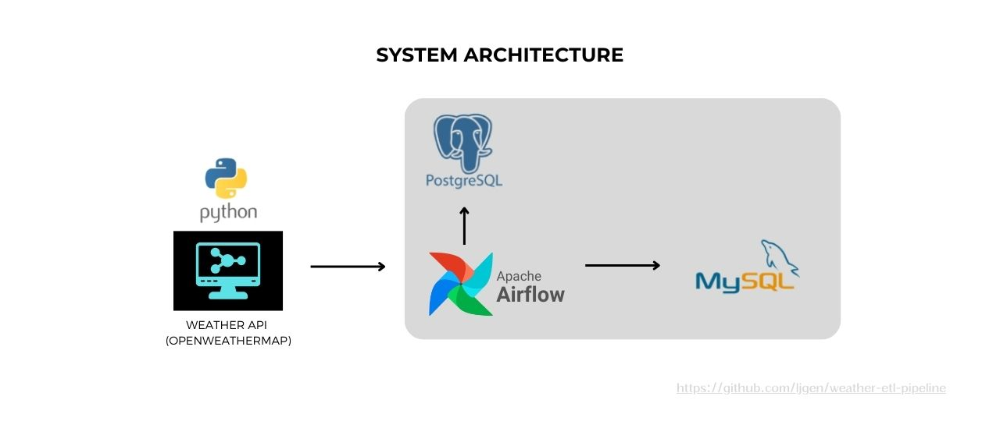

# **Weather Data ETL Pipeline**
This project is a real-time ETL pipeline that fetches weather data from a weather API, processes the temperature data, and inserts it into a MySQL database using Apache Airflow. The entire environment is containerized using Docker Compose for easy deployment and management.

# Overview

The project consists of an ETL pipeline where:

**1. Extract:** Data is fetched from a public weather API (e.g., OpenWeatherMap).

**2. Transform:** The temperature data is converted to a specified unit (e.g., Kelvin (K) to Celsius (°C)).

**3. Load:** The transformed data is inserted into a MySQL database for storage.

*Apache Airflow is used to orchestrate the ETL process, and Docker Compose is employed to run the entire stack in isolated containers.*

# Technologies Used
- **Airflow:** For orchestrating the ETL pipeline.
- **Python:** For data processing and interacting with APIs.
- **MySQL:** For storing the transformed weather data.
- **Docker Compose:** For managing containerized services.
- **Weather API:** For fetching weather data (e.g., OpenWeatherMap API).

# **How It Works**
**1. Weather API:** The Airflow DAG periodically fetches weather data from the weather API.

**2. Data Transformation:** The temperature is extracted and converted from kelvin to celsius.

**3. Data Insertion:** The transformed data is inserted into the MySQL database.

**4. Airflow:** Airflow handles task dependencies, retries, and scheduling.

# Getting Started
### **1. Environment Setup**
To run the project locally, you need to set up the following environment variables:

- `API_KEY:` Your API key from the weather API service.
- `MYSQL_USER:` The MySQL user.
- `MYSQL_PASSWORD:` The MySQL password.
- `MYSQL_DATABASE:` The name of the MySQL database.

These environment variables are stored in the .env file, which is read by the Docker containers.

### **2. Running the Project with Docker Compose**
To start the project, simply run:
```
docker-compose up --build -d
```
This will:
1. Build the necessary Docker images for Airflow and MySQL.
2. Start the Airflow scheduler and webserver.
3. Start MySQL to store the weather data.
4. Run the Airflow DAG that fetches weather data, processes it, and loads it into the MySQL database.

### **3. Accessing Airflow UI**
After running the project, you can access the Airflow UI at:
```
http://localhost:8080
```
From here, you can trigger the DAG manually or let it run on its schedule.

### **4. Database**
The transformed weather data will be stored in the MySQL database. You can connect to the MySQL instance with:

- **Host:** localhost
- **Port:** 3306
- **User:** Set your username
- **Password:** Set your password
- **Database:** Set your database name

# Project Structure
```
├── dags/                              # Airflow DAGs and tasks
│   └── weather_etl.py                 # ETL processing logic
│   └── weather_etl_airflow_task.py    # Airflow task definitions
├── script/                            
│   └── entrypoint.sh                  # Sets up the container on start.
└── README.md                          # Project documentation
├── docker-compose.yml                 # Docker Compose configuration file
├── requirements.txt                   # Python dependencies
```